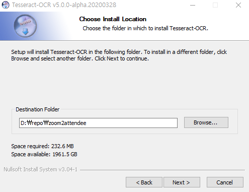
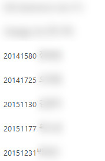
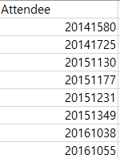

# Zoom 출석체크 자동화 보조 Tool
## Install
1. [Tesseract 설치](https://github.com/UB-Mannheim/tesseract/wiki)
: Path는 현재 폴더로 해주세요. <br>


2. Python Packages 설치
```shell
pip install -r requirements.txt
```

## Usage
1. Zoom에서 참가자 스크린샷을 학번과 이름만 보이게 찍어주세요. <br>

2. 스크린샷 이미지를 'images' 폴더에 넣어주세요.
3. 스크립트를 실행시켜주세요.```python main.py ```
4. 참가자 명단이 오늘 날짜로 'attendees' 폴더에 저장됩니다. (예. 2020-04-10.csv) <br>

